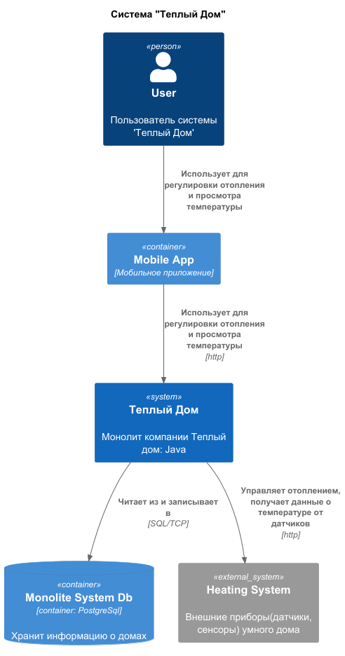
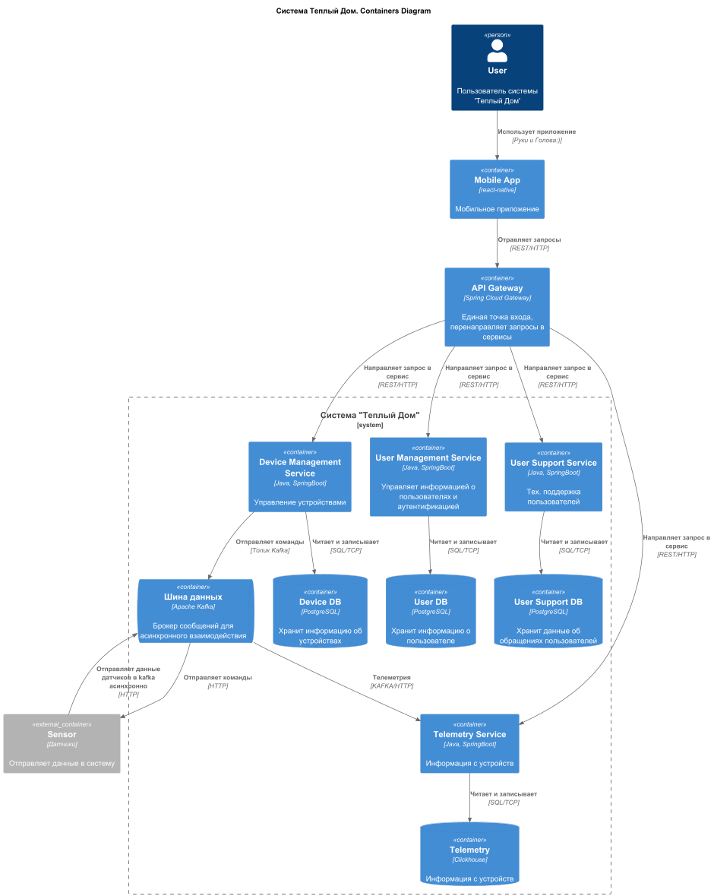
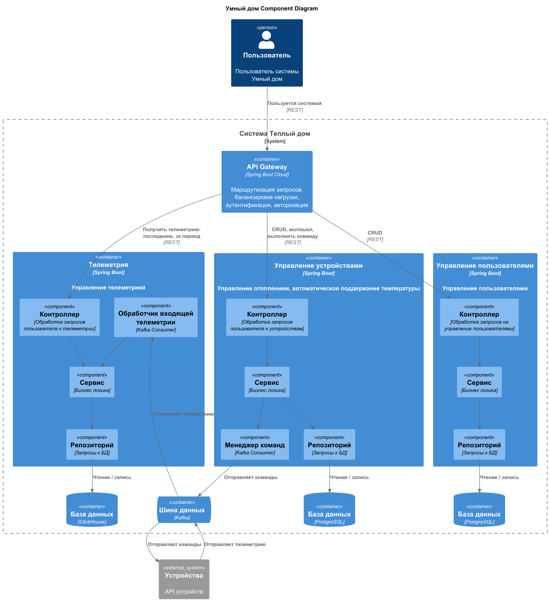
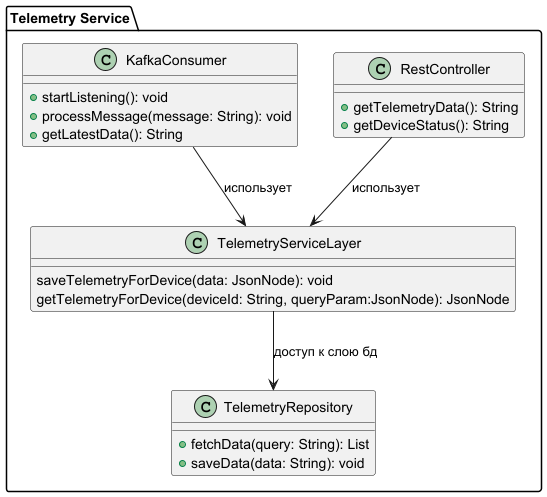
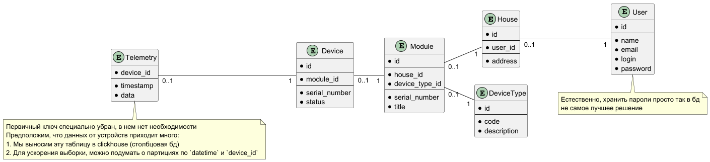

# Часть 1

# Задание 1. Анализ и планирование

## 1.1 Функциональность монолитного приложения

**1. Управление отоплением:**

* Пользователи могут удалённо включать/выключать отопление в своих домах.
* Пользователи могут устанавливать желаемую температуру.
* Система автоматически поддерживает заданную температуру, регулируя подачу тепла.

**2. Мониторинг температуры:**

* Система получает данные о температуре с датчиков, установленных в домах.
* Пользователи могут просматривать текущую температуру в своих домах через веб-интерфейс.

## 1.2 Анализ архитектуры монолитного приложения

### 1.2.1 Язык программирования: Java

1. Портативность: Код работает на любой платформе с JVM.
2. Объектно-ориентированность: Простота в моделировании реальных объектов.
3. Безопасность: Встроенные механизмы для предотвращения уязвимостей.
4. Обширная стандартная библиотека: Множество готовых решений для различных задач.
5. Многопоточность: Поддержка параллельного выполнения потоков.
6. Высокая производительность: Современные оптимизации и JIT-компиляция.
7. Большое сообщество: Множество ресурсов и активная поддержка.
8. Инструменты разработки: Поддержка IDE, таких как IntelliJ IDEA и Eclipse.
9. Совместимость: Поддержка интеграции с другими языками и технологиями.
10. Широкое применение: Используется в веб-разработке, мобильных приложениях и корпоративных системах.

### 1.2.2 База данных: PostgreSQL

1. Открытый исходный код: Бесплатное использование и возможность модификации.
2. Совместимость с ACID: Обеспечивает надежность транзакций.
3. Расширяемость: Поддержка пользовательских функций, типов данных и операторов.
4. Совместимость со стандартами SQL: Поддержка большого количества стандартов SQL.
5. Поддержка сложных запросов: Работа с подзапросами, CTE и оконными функциями.
6. Репликация и масштабирование: Поддержка репликации и распределенных систем.
7. Безопасность: Поддержка аутентификации и шифрования.
8. Активное сообщество: Регулярные обновления и поддержка.
9. Поддержка JSON и XML: Хранение и обработка данных в форматах JSON и XML.
10. Полнотекстовый поиск: Интегрированная поддержка полнотекстового поиска.

### 1.2.3 Архитектура: Монолитная
Плюсы монолитного приложения:

1. Простота разработки: Легче начать проект с одним кодовым базисом.
2. Упрощенное тестирование: Все части системы в одном окружении.
3. Целостность данных: Общая база данных для всего приложения.
4. Меньше накладных расходов: Нет необходимости в настройке коммуникаций между сервисами.
5. Единая точка развертывания: Обновления и изменения вносятся централизованно.

Минусы монолитного приложения:

1. Сложность в масштабировании: Трудно масштабировать отдельные компоненты.
2. Затрудненная поддержка: Изменения в одном месте могут повлиять на весь код.
3. Долгое время развертывания: Большие и сложные обновления.
4. Ограниченная гибкость: Трудно внедрять новые технологии или языки.
5. Трудности в распределенной разработке: Затруднено распределение задач между командами.

### 1.2.4 Взаимодействие: Синхронное
Плюсы синхронного взаимодействия:

1. Быстрая обратная связь: Участники могут сразу же реагировать на действия друг друга, что ускоряет процесс общения.
2. Повышенное вовлечение: Одновременное участие всех сторон может повысить заинтересованность и концентрацию.
3. Эффективное решение проблем: Возможность моментального обсуждения и принятия решений.

Минусы синхронного взаимодействия:

1. Зависимость от времени: Все участники должны быть доступны в одно и то же время, что может быть неудобно.
2. Давление времени: Необходимость принимать решения в реальном времени может привести к ошибкам.
3. Технические ограничения: Требует устойчивого интернет-соединения и подходящих инструментов для общения.

### 1.2.5 Развертывание: Требует остановки всего приложения. 
Плюсы:

1. Простота управления: Все компоненты приложения находятся в одном месте, что упрощает его развертывание и управление.
2. Упрощенная разработка: Разработка может быть более простой, так как команда работает с одной кодовой базой.
3. Легкость тестирования: Единая кодовая база облегчает написание и выполнение тестов.
4. Высокая производительность: Взаимодействие между компонентами внутри одного процесса может быть быстрее.

Минусы:

1. Сложность масштабирования: Масштабирование отдельных компонентов может быть сложным, так как приходится масштабировать все приложение.
2. Зависимости: Изменения в одном модуле могут повлиять на другие модули, что увеличивает риск ошибок.
3. Ограниченная гибкость: Трудно применять разные технологии для разных частей приложения.
4. Длительное время развертывания: Из-за большого размера приложения развертывание может занимать много времени.

## 1.3 Домены и границы контекстов

* **Домен: управление устройствами**

  * Поддомен: управление отоплением
    * Контекст: включение\выключение устройства
    * Контекст: установка необходимой температуры
  * Поддомен: автоматическое поддержание температуры
    * Контекст: регулировка подачи тепла
* **Домен: мониторинг температуры**

  * Поддомен: приём данных с датчиков
    * Контекст: получение данных с датчиков о температуре
  * Поддомен: отображение данных пользователю
    * Контекст: отображение текущей температуры в доме пользователя

## 1.4 Проблемы бизнес-задач:

- Трудности с добавлением новых функций.
- Невозможность масштабировать отдельные функции.
- Устройства нельзя подключить самостоятельно; требуется помощь специалиста.
- Увеличение числа пользователей приведет к перегрузке приложения.
- Синхронные операции могут замедлить ответ пользователю (при большой нагрузке).
- Обновление приложения требует его полной остановки, что делает его временно недоступным для пользователей.

## 1.5 Диаграмма контекста
[C4 диаграмма (System Context diagram)](diagrams/ctx_mono.puml)

# Задание 2. Проектирование микросервисной архитектуры

## 2.1 Декомпозиция приложения ("TO-BE")

- Домен: управление устройствами (DeviceManagementService)
  - поддомен: добавление новых устройств
  - поддомен: настройка устройств
    - контекст: вкл./выкл. устройств
    - контекст: перенастройка устройств

- Домен: управление пользователями (UserManagementService)
  - поддомен: создание/удаление пользователя
  - поддомен: редактирование профиля
  - поддомен: аутентификация и авторизация пользователей

- Домен: мониторинг устройств (TelemetryService)
  - поддомен: просмотр данных с датчиков устройства
  - поддомен: статус устройства
    - контекст: последняя дата обслуживания
    - контекст: заряд(при наличии)

- Домен: поддержка пользователей
  - поддомен: создание заявки
    - контекст: чат с тех. поддержкой
    - контекст: вызов мастера
  - поддомен: обработка заявки

## 2.2 Взаимодействие между компонентами
* API Gateway - для маршрутизации запросов через одну точку входа к микросервисам;
* Kafka - для возможности асинхронного взаимодействия;
* Все микросервисы написаны на яп Java, используем Spring Boot;
* Каждый микросервис использует свою бд, в основном это рбд - PostgreSQL. Для телеметрии используем колоночную бд ClickHouse.

## 2.3 Визуализация архитектуры (С4) 

### 2.3.1 C4 — Уровень контейнеров (Containers)
[C4 — Уровень контейнеров](diagrams/c4_container.puml)

### 2.3.2 C4 — Уровень компонентов (Components)
[C4 — Уровень компонентов](diagrams/c4_components.puml)

### 2.3.3 C4 — Уровень кода (Code)
[C4 — Уровень компонентов](diagrams/c4_code.puml)

# Задание 3. Разработка ER-диаграммы

## **3.1 Идентификация сущностей**

* Пользователь (User)
* Дом (House)
* Устройство (Device)
* Тип устройства (DeviceType)
* Модуль (Module)
* Телеметрия (Telemetry)

## **3.2 Определение атрибутов**

**Сущность "Дом (House)"**

* `id` — уникальный идентификатор дома.
* `user_id` — идентификатор пользователя (ссылка на `User`).
* `address` — адрес дома.

**Сущность "Пользователь (User)"**

* `id` — уникальный идентификатор пользователя.
* `name` — имя пользователя.
* `email` — почта пользователя.
* `login` — логин пользователя.
* `password` — пароль пользователя.

**Сущность "Модуль (Module)"**

* `id` — уникальный идентификатор модуля.
* `house_id` — идентификатор дома, в котором установлен модуль (ссылка на `House`).
* `device_type_id` — идентификатор типа устройства (ссылка на `DeviceType`).
* `serial_number` — серийный номер модуля.
* `title` — название модуля.

**Сущность "Тип устройства (DeviceType)"**

* `id` — уникальный идентификатор типа устройства.
* `code` — код типа устройства.
* `description` — описание типа устройства.

**Сущность "Устройство (Device)"**

* `id` — уникальный идентификатор устройства.
* `module_id` — идентификатор модуля, к которому подключено устройство (ссылка на `Module`).
* `serial_number` — серийный номер устройства.
* `status` — текущее состояние устройства (включено/выключено).

**Сущность "Телеметрия (Telemetry)"**

* `device_id` — идентификатор устройства, который отправляет данные (ссылка на `Device`);
* `timestamp` — дата и время получения данных;
* `data` — данные телеметрии.

## **3.3 Описание связей**

* **Пользователь(User) — Дом(House):** один-ко-многим, один пользователь может иметь доступ к нескольким домам, но каждый дом связан только с одним пользователем.
* **Модуль(Module) — Дом(House):** один-ко-многим, в одном доме может быть установлено несколько модулей, но каждый модуль связан только с одним домом.
* **Модуль(Module) — Тип устройства(DeviceType):** один-ко-многим, один тип устройства может быть у нескольких модулей, но к одному модулю могут быть подключены устройства только одного типа.
* **Устройство(Device) — Модуль(Module):** один-ко-многим, к одному модулю могут быть подключены несколько устройств, но каждое устройство связано только с одним модулем.
* **Телеметрия(Telemetry) — Устройство(Device):** один-ко-многим, одно устройство может создавать несколько записей, но каждая запись должна быть связана только с одним устройством.

## **3.4 Построение ER-диаграммы**

[ER Диаграмма](diagrams/er.puml)

# Часть 2

## Задание 1. Создание и документирование API

**Пару слов об апи.**
Можно заменить, что явно пользователь в некоторые запросы не передается. Сделано так из соображений, что запрос приходит уже от авторизованного пользователя,
следовательно, принципала с его ролями мы сможем достать из сессии.
Ну и в принципе, фильтры по пользователям доступны только администратору.

Решил не делать асинхронное апи, но возможно оно бы зашло для формирования репортов из телеметрии.

- [Управление устройствами (device-management-service)](docs%2Fdevice-management-service.yaml)
- [Сервис телеметрии (telemetry-service)](docs%2Ftelemetry-service.yaml)
- [Сервис управления пользователями (user-management-service)](docs%2Fuser-management-service.yaml)
- [Сервис Тех. Поддержки (user-support-service)](docs%2Fuser-support-service.yaml)